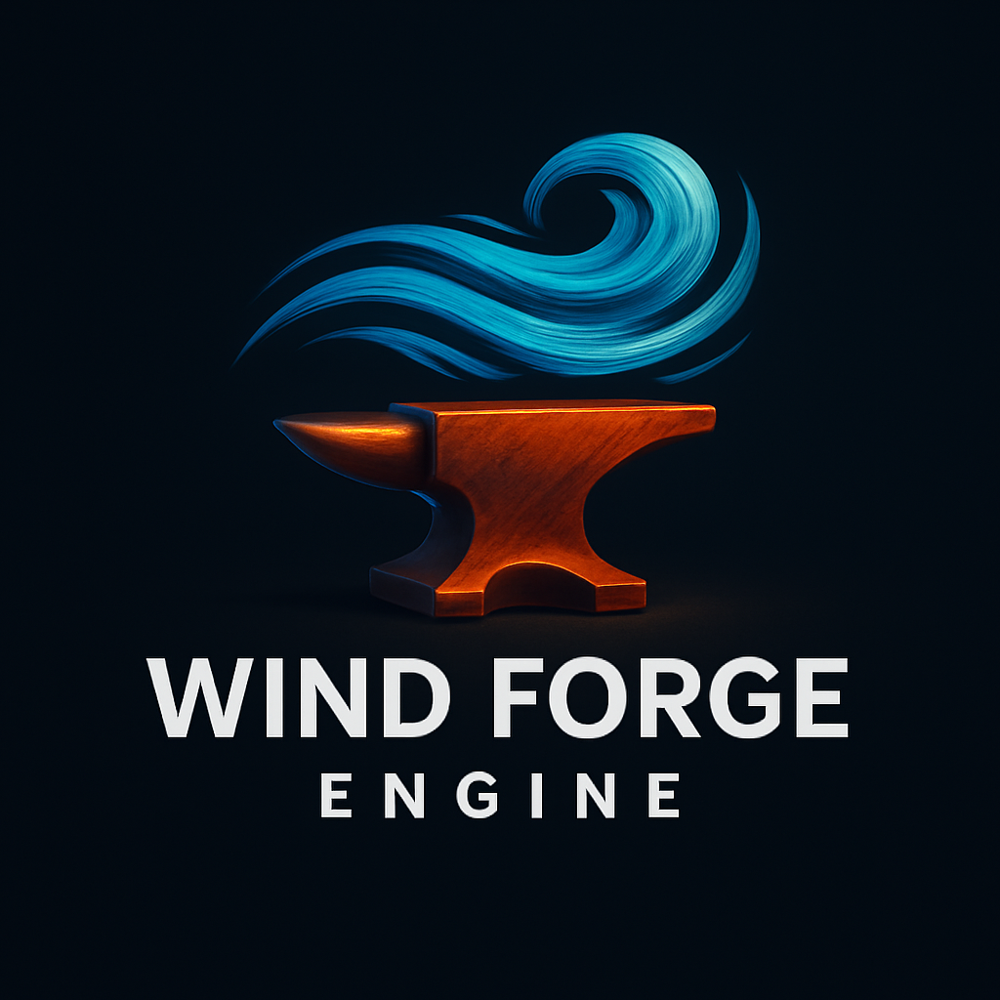

<div style="background: white; padding: 20px; border-radius: 12px; box-shadow: 0 8px 16px rgba(0, 0, 0, 0.1); text-align: center;">
    <p align="center">
        🎉 100th Repository! 🎉
        <br><br>
        
    </p>
</div>

<br>

This repo proposes a Python powered Engine/Framework for interactive Graphics-Based Applications such as Games. <br>
This project also functions as reference project for OpenGL with Python using the standard PyOpenGL (not the moderngl python lib), with knowledge and examples.


Contents:
- [Progress](#progress)
- [The Wind Forge Engine](#the-wind-forge-engine)
- [General](#general)
- [Graphics Pipeline](#graphics-pipeline)
- [Installation](#installation)
- [Lifecycle of interactive graphics-based applications](#lifecycle-of-interactive-graphics-based-applications)
- [Input Processing](#input-processing)
- [Examples](#examples)


<br><br>

---
### Progress

🚩 = Current Step<br>
✅ = Achieved Step

```text
Engine Development Progress
------------------------------

🚩
[Step 1] Setup & Basics 
   └─ Core Concept Design/Idea
   └─ Window Creation (PyGame & GLFW)
   └─ Input Processing (PyGame & GLFW)
   └─ Simple OpenGL triangle

      |
      v

[Step 2] ???

```


<br><br>

---
### The Wind Forge Engine 

The Wind Forge Graphics/Game Framework/Engine is a here proposed graphics lib, working with PyGame and PyOpenGL. This framework/engine is mostly taken to show how to make (interactive) graphics-base applications and it is inspired on the [py3d framework](https://github.com/ax-va/PyOpenGL-Pygame-Stemkoski-Pascale-2021). 

Supported Window Backends (for window creation and input processing):
- [x] [PyGame](https://pypi.org/project/pygame/)
- [x] [GLFW](https://pypi.org/project/glfw/) (-> Not recommended, Controller Input broken)
- [ ] [PyQt](https://pypi.org/project/PyQt6/)
- [ ] [SDL](https://pypi.org/project/PySDL3/)
- [ ] [Tkinter (with extension)](https://pypi.org/project/pyopengltk/)


Supported Render Backends:
- [x] [PyOpenGL](https://pypi.org/project/PyOpenGL/)
- [ ] [ModernGL](https://pypi.org/project/moderngl/)
- [ ] [Vulkan (?)](https://pypi.org/project/vulkan/)
- [ ] [Panda3D (?)](https://pypi.org/project/Panda3D/)
- [ ] [wgpu-py (?)](https://pypi.org/project/wgpu/)


<br><br>

---
### General

We use PyOpenGL to render 3 dimensional environments (including 3 dimensional and 2 dimensional objects) into 2 dimensional images/frames (2 dimensional arrays with float values for red, green and blue pixel-values - which are the colors we primarily see). For that we need a virtual camera to decide which perspective we choose in the 3 dimensional space.<br>
PyOpenGL is an interface (API) to OpenGL (originally written in C). OpenGL itself is an interface (API) to the shader language OpenGL Shading Language (GLSL), a cross platform library to access functionalities on the GPU, including rendering, memory management, and shader execution.

> *Shaders* are programs that run on the GPU. They were originally called that because they were first used to calculate shading, i.e., how light interacts with surfaces to produce effects such as brightness, color, and shadow. Over time, shaders evolved beyond shading effects and are now used for many different tasks in the graphics pipeline, such as transforming geometry, computing lighting, applying textures, or even performing general-purpose computations on the GPU. Despite this broader functionality, the original name “shader” was kept.

Another important concept to know are *buffers*, also called *data buffers* or *buffer memory*. Buffers are temporary memory storage, and in computer graphics there are different types of buffers that store different kinds of data.<br>
The most important - in computer-graphics - is the **framebuffer**, which is memory used to store pixel data for rendering images. A framebuffer might contain multiple sub-buffers:
- **color buffer** - storing RGB values, with a alpha value for transparency
- **depth buffer** - storing the depth/distances of the objects in the scene from the perspective of the virtual camera
- **stencil buffer** - for advanced effects -> shadow, reflection, portal rendering

A common concept is to use 2 framebuffers also called **Double-Buffering**, where there are 2 framebuffers. One framebuffer gets constantly rendered and the other framebuffer gets the new data to render. Then they swap and the new data can be shown and the other framebuffer gets overwritten.

> The famous *vertical-synchronisation* technique uses this concept but waits with the swapping until the current displaying/render process on the monitor is finish and then swap the framebuffers. Therefore this can cost FPS but does avoid *screen tearings*, which appear when swapping frambuffers while a render process was not finish.

**Antialiasing** is an important technique used to smooth jagged edges and reduce the “pixelated” look of graphics. There are different approaches to achieve this. For example, modern games often use deep learning–based methods, while more traditional solutions rely on fixed algorithms. Antialiasing techniques can be broadly divided into those that rely on rendering at higher resolutions and then downsampling, and those that work at the native resolution. In our case, we will use **MSAA** (Multisample Anti-Aliasing), which computes the average of multiple samples per pixel. This does not mean the scene is rendered multiple times, but rather that each pixel is sampled at several sub-pixel positions and the results are averaged. Other common techniques include **SSAA** (Supersample Anti-Aliasing), **FXAA** (Fast Approximate Anti-Aliasing), and **DLSS** (Deep Learning Super Sampling).

<br><br>

---
### Graphics Pipeline

The graphics pipeline is an abstract proceeding of steps in order to render an 3 dimensional scene. The benefit is to create subtasks which might can run in parallel and therefore improve the efficiency of rendering. The pipeline consists of 4 steps:
1. **Application Stage** - Runs on the CPU. This stage prepares the data to be sent to the GPU, including geometry (vertices, indices), textures, and shader programs. It also handles the basic window generation (where the rendering should be displayed to) and scene logic such as object transformations, camera movement, and culling (deciding which objects are visible). The result of this stage is the data that will be processed by the GPU.
2. **Geometry Processing** - Runs on the GPU. Here, the vertices of objects are transformed from 3D world space into 2D screen space using matrices (model, view, projection). This stage may include vertex shading, tessellation, and geometry shading, as well as lighting calculations at the vertex level. The output is a set of processed primitives (points, lines, triangles).
3. **Rasterization** - Converts the primitives from the geometry stage into fragments (potential pixels). Each fragment corresponds to a position on the screen and carries interpolated data (like color, depth, texture coordinates) from the vertices. This is the step that turns vector-like geometry into pixel-level data.
4. **Pixel Processing** - Runs fragment shaders on each fragment to determine its final color. This includes texture sampling, per-pixel lighting, and special effects. After shading, fragments go through tests (depth test, stencil test, blending) to decide whether and how they contribute to the final image in the framebuffer.

> The shape of an geometric object is  defined by a mesh: a collection of points that are grouped into lines or triangles.

Visualized in ASCII-style:
```text
   ┌────────────────────┐
   │  Application Stage │  (CPU)
   │  - Scene logic     │
   │  - Geometry setup  │
   │  - Culling         │
   └─────────┬──────────┘
             │
             ▼
   ┌────────────────────┐
   │ Geometry Processing│  (GPU)
   │  - Vertex shading  │
   │  - Transformations │
   │  - Lighting calc.  │
   └─────────┬──────────┘
             │
             ▼
   ┌────────────────────┐
   │   Rasterization    │  (GPU)
   │  - Primitives →    │
   │    Fragments       │
   │  - Interpolation   │
   └─────────┬──────────┘
             │
             ▼
   ┌────────────────────┐
   │ Pixel Processing   │  (GPU)
   │  - Fragment shader │
   │  - Texturing       │
   │  - Blending, tests │
   └─────────┬──────────┘
             │
             ▼
      ┌──────────────┐
      │ Framebuffer  │  (Image Output)
      └──────────────┘

```

<!--
<div align="center">

```text
   ┌────────────────────┐
          │  Application Stage │  (CPU)
   │  - Scene logic     │
   │  - Geometry setup  │
   │  - Culling         │
   └─────────┬──────────┘
  │
  ▼
   ┌────────────────────┐
          │ Geometry Processing│  (GPU)
   │  - Vertex shading  │
   │  - Transformations │
   │  - Lighting calc.  │
   └─────────┬──────────┘
  │
  ▼
   ┌────────────────────┐
          │   Rasterization    │  (GPU)
   │  - Primitives →    │
   │    Fragments       │
   │  - Interpolation   │
   └─────────┬──────────┘
  │
  ▼
   ┌────────────────────┐
          │ Pixel Processing   │  (GPU)
   │  - Fragment shader │
   │  - Texturing       │
   │  - Blending, tests │
   └─────────┬──────────┘
  │
  ▼
    ┌──────────────┐
                    │ Framebuffer  │  (Image Output)
    └──────────────┘

```

</div>
-->


<br><br>

---
### Installation

For python installation see https://github.com/xXAI-botXx/Project-Helper#python-installation-1 or use python via anaconda, see: https://github.com/xXAI-botXx/Project-Helper#anaconda .<br>
This reference uses the pip, pythons official package manager in combination with anaconda, to create a virtual environment.

Open your bash or the anaconda bash and install these dependencies:
```bash
conda create -n windforge python=3.12 pip -y
conda activate windforge
pip install numpy pygame glfw
pip install PyOpenGL PyOpenGL_accelerate
```

Also see the official page of PyOpenGL: https://pypi.org/project/PyOpenGL/

Now test your installation, via:

```bash
python
import pygame
import numpy
import OpenGL
exit()
```

(You can check pygame also with `python -m pygame.examples.aliens`)

> You can find your current python location with: `python -m site` or with that for a specific module `python -c "import OpenGL; print(OpenGL.__file__)"`

Also see:
- https://numpy.org/install/
- https://www.pygame.org/wiki/GettingStarted and https://www.pygame.org/docs/
- https://github.com/mcfletch/pyopengl and https://mcfletch.github.io/pyopengl/documentation/index.html and https://pypi.org/project/PyOpenGL/


<br><br>

---
### Lifecycle of interactive graphics-based applications

A common computer-graphics lifecycle for games or animations can look like this, and it s pretty much the famous Game-Loop:
1. **Start**<br>
    Load all external libraries, create objects and initialize values.
2. **Application Loop**<br>
    This is the main loop of the application (game, animation) and runs at a specific frames per second (FPS).
    1. **Process Input** <br>
        Check user input and process it (keyboard, mouse, controller).
    2. **Update** <br>
        Updating the logic/all objects, there positions, color, geometry and maybe delete or create new objects.
    3. **Generate Output** <br>
        Generate the output of your application. In our graphical application this will of course be *rendering* but maybe also audio effects and sometimes also different other things.
3. **End**<br>
    When the user end the program (most likely detected by the process of the input/the window application), the main loop will be exited and deleting and stopping all processes which have to be stopped.

Still the process can be adjusted for your needs with not much effort at all. For example if you just want to render one image, save it and quit, then you most likely have to delete/cancel some steps and you are fine.

<br><br>

---
### Input Processing

The Wind-Forge provides his own input processing and therefore provides here a little introduction with all you need to get started with your own game using keyboard and controller.

The input processing system from Wind-Forge is for keyboards, mice, and controllers across multiple window backends (e.g., Pygame, GLFW). It includes classes to track input states, map backend-specific input events to internal representations, and manage controller events and window events consistently.

<br>

**Important Enumerations:**
* `WindowLib` – Defines the backend library for window creation and input processing
    * `PYGAME`
    * `GLFW`
* `EventType` – Defines all possible events
    * Window: `WINDOW_MOVE`, `WINDOW_RESIZE`, `WINDOW_ACCESS`, `WINDOW_ACTIVATION`, `QUIT`
    * Keyboard: `KEY_DOWN`, `KEY_UP`
    * Mouse: `MOUSE_MOVE`, `MOUSE_DOWN`, `MOUSE_UP`, `MOUSE_WHEEL`
    * Controller: `CONTROLLER_ADDED`, `CONTROLLER_REMOVED`, `CONTROLLER_BUTTON_DOWN`, `CONTROLLER_BUTTON_UP`, `CONTROLLER_AXIS_MOVE`
* `Key` – Keyboard keys (A-Z, `SPACE`, `ENTER`, `SHIFT`, `CTRL`, `ALT`, `ESC`, `TAB`, `BACKSPACE`, arrow keys)
* `MouseButton` – Mouse input buttons
    * `LEFT`, `RIGHT`, `MIDDLE`, `BUTTON4`, `BUTTON5`
* `ControllerButton` – Digital controller buttons (Xbox layout)
    * `A`, `B`, `X`, `Y`, `LB`, `RB`, `LT`, `RT`, `START`, `SELECT`, `LSTICK`, `RSTICK`, `DPAD`
    * >`LB` = Left Bumper
* `ControllerAxis` – Analog axes for controllers
    * `LEFT_STICK_X`, `LEFT_STICK_Y`, `RIGHT_STICK_X`, `RIGHT_STICK_Y`, `LEFT_TRIGGER`, `RIGHT_TRIGGER`
* `DpadState` – D-pad directional states
    * `NEUTRAL`, `UP`, `DOWN`, `LEFT`, `RIGHT`, `UP_RIGHT`, `UP_LEFT`, `DOWN_RIGHT`, `DOWN_LEFT`

<br><br>

**Core Classes:**

* `Event` – Represents a single event with attributes such as `type`, `key`, `mouse_position`, `controller_id`, `axis_value`, etc.
* `InputState` – Maintains global input state:
    * Tracks pressed keys, mouse buttons, mouse position, connected controllers, window states
    * `update(events)` – Processes a list of Event objects, updating internal states and returning a list of processed events
    * `missing_controller_process(event)` – Handles events for unknown controllers by adding them automatically after repeated detection
    * `get_all_active()` – Returns all currently active inputs including keys, mouse buttons, positions, and controller states
* `Controller` – Represents a controller’s state:
    * Tracks button presses, axis values, and D-pad state
    * `get_button(button)` – Returns button pressed state
    * `get_axis(axis)` – Returns axis value
    * `update_button(button, pressed, dpad_state)` – Updates button state
    * `update_axis(axis, value)` – Updates axis state
    * `get_pressed_buttons()` – Returns list of currently pressed buttons
    * `get_active()` – Returns dict of active buttons and non-neutral axis values
    * `get_dpad_state()` – Returns current D-pad state
* `Window` – High-level interface for window creation and event management:
    * Uses a backend (`PygameBackend` or `GlfwBackend`)
    * `events()` – Returns processed input events from the backend
    * `display()` – Swaps buffers for rendering
    * `quit()` – Closes the window
* `WindowBackend` (abstract) – Defines required backend methods:
    * `get_events()`, `get_controllers()`, `swap_buffers()`, `quit()`
* `PygameBackend` – Concrete backend implementation using Pygame
* `GlfwBackend` – Concrete backend implementation using GLFW

<br><br>

**Functions:**

* `str_to_version(version_str, number_amount=None)`

  * Converts version strings like `"3.2"` → `[3, 2]`
  * Pads or truncates depending on `number_amount`

<br><br>

Also important to know are the **value ranges** for the axes:
* Sticks (`LEFT_STICK_X`, `LEFT_STICK_Y`, `RIGHT_STICK_X`, `RIGHT_STICK_Y`):
    * Value range: -1.0 → +1.0
    * Neutral position: 0.0
    * Negative = left / up, Positive = right / down
    * ASCII-Visualied of one Stick: 
        ```text
                -1.0

        -1.0     0.0    1.0
            
                 1.0
        ```
* Triggers (`LEFT_TRIGGER`, `RIGHT_TRIGGER`):
    * Value range: 0.0 → 1.0
    * Neutral position: 0.0 (not pressed)
    * Fully pressed = 1.0

<br><br>

**Practise**

In practise you need to call `self.window.events()` to poll events and update the internal state of input devices -> this call is already done for you (except if you do `deactivate_pre_input_processing=True`, then you should call it by yourself) and all polled events are available with `self.events`.<br>
The Wind-Forge provides you 2 information sources for input devices, one for active events (presses and releases) -> self.events which is a list of `windforge.window.EventType` and one source for passive 'events' (holded), therefore there are no events and it is provided by an object `self.window.input_state` (`windforge.window.InputState` class) -> but you also just can call the `self.window.input_state.get_all_active()` to get all holded inputs.<br>
The `self.window.input_state.get_all_active()` returns:
- dict[str, dict]
    - `keys` - list(windforge.window.Key) Key holded
    - `mouse` - list(windforge.window.MouseButton) Mousebutton holded
    - `controllers` - dict[int, list(windforge.window.ControllerButton/ControllerAxis)]

Example:
```python
import sys
sys.path += ["."]
import windforge as wf


class YourAwesomeApp(wf.GraphicsApplication):
    def __init__(self):
        super().__init__(size=[512, 512],
                        resizable=True,
                        title="Interactive Computer-Graphics Application with Wind-Forge",
                        multisample=True, 
                        samples=4, 
                        depth_buffer=24, 
                        gl_version=None, 
                        post_process=[],
                        background_lib=wf.window.WindowLib.PYGAME,
                        goal_fps=60,
                        deactivate_pre_input_processing=False,
                        print_missed_events=False,
                        print_catched_events=False)

    def initialize(self):
        self.counter = 0

    def process_input(self):
        if self.counter == 0:
            holded_inputs = self.window.input_state.get_all_active(as_string=True)
            print(f"Keyboard holds [{', '.join(holded_inputs['keys'])}]")
            print(f"Mouse holds [{', '.join(holded_inputs['mouse'])}]")
            for cid, holded_controller_inputs in holded_inputs["controllers"].items():
                print(f"Controller {cid} holds [{', '.join(holded_controller_inputs)}]")

    def update(self):
        self.counter += 1

        if self.counter > self.goal_fps:
            self.counter = 0


if __name__ == "__main__":
    YourAwesomeApp().run()
```

If you still want to use the object itself for the holded inputs, notice following information:<br>
The input state attribute have following attributes:
- `controller_event_tolerance` - float
- `keys` - dict[windforge.window.Key, bool]
- `mouse_buttons` - dict[windforge.window.MouseButton, bool]
- `mouse_position` - tuple(int, int)
- `controllers` - dict[int, windforge.window.Controller]
- `missed_controllers` - dict[int, int] -> counter for how often missing
- `window` - dict[str, bool/list(int, int)] -> "position", "size", "accessed", "active"
- `quit` - bool

Where controllers are a dictionary from the controller class with following attributes:
- `controller_id` - int
- `A` - bool
- `B` - bool
- `X` - bool
- `Y` - bool
- `LB` - bool
- `RB` - bool
- `START` - bool
- `SELECT` - bool
- `LSTICK` - bool
- `RSTICK` - bool
- `DPAD` - bool
- `dpad_state` - windforge.window.DpadState
- `LEFT_STICK_X` - float
- `LEFT_STICK_Y` - float
- `RIGHT_STICK_X` - float
- `RIGHT_STICK_Y` - float
- `LEFT_TRIGGER` - float
- `RIGHT_TRIGGER` - float

Here are some simple example for the input event access:

```python
class YourAwesomeApp(wf.GraphicsApplication):
    def __init__(self):
        super().__init__(size=[512, 512],
                        resizable=True,
                        title="Interactive Computer-Graphics Application with Wind-Forge",
                        multisample=True, 
                        samples=4, 
                        depth_buffer=24, 
                        gl_version=None,# "3.3", 
                        post_process=[],
                        background_lib=wf.window.WindowLib.PYGAME,
                        goal_fps=60,
                        deactivate_pre_input_processing=False,
                        print_missed_events=False,
                        print_catched_events=False)

    def initialize(self):
        pass

    def process_input(self):
        # Printing all Axis Move Events
        for event in self.events:
            if event.type == wf.window.EventType.CONTROLLER_AXIS_MOVE:
                print(f"{event.axis}: {event.axis_value}")

        # Access holded inputs
        active = self.window.input_state.get_all_active()
        for cid, actives in active["controllers"].items():
            if wf.window.ControllerAxis.RIGHT_STICK_X in actives:
                print(f"Controller {cid}: Right Stick is Active")
```

```python
class YourAwesomeApp(wf.GraphicsApplication):
    def __init__(self):
        super().__init__(size=[512, 512],
                        resizable=True,
                        title="Interactive Computer-Graphics Application with Wind-Forge",
                        multisample=True, 
                        samples=4, 
                        depth_buffer=24, 
                        gl_version=None,# "3.3", 
                        post_process=[],
                        background_lib=wf.window.WindowLib.PYGAME,
                        goal_fps=60,
                        deactivate_pre_input_processing=False,
                        print_missed_events=False,
                        print_catched_events=False)

    def initialize(self):
        pass

    def process_input(self):
        # Printing all holded inputs
        active = self.window.input_state.get_all_active()
        for cid, actives in active["controllers"].items():
            print(f"Controller {cid} holds {actives}")
```


<br><br>


---
### Examples

...


